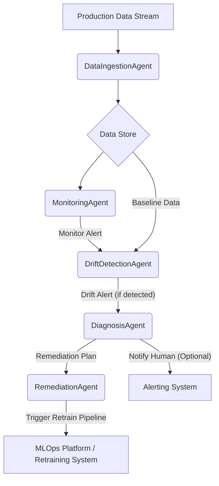

## DriftGuard Autonomous MLOps Agent: Functionality and Architecture

DriftGuard is designed to be a robust, production-grade system for proactive model performance management. It operates through a modular, multi-agent architecture that allows for continuous monitoring, intelligent diagnosis, and automated remediation of model drift.

### Core Design Principles

1.  **Modularity**: Each component (agent) is responsible for a specific task, promoting loose coupling and easier maintenance, testing, and extension.
2.  **Event-Driven**: Agents communicate asynchronously via a message bus, enabling reactive processing and decoupled workflows.
3.  **Proactive Remediation**: The system aims to detect and address issues before they significantly impact business outcomes, minimizing downtime and performance degradation.
4.  **Extensibility**: Designed to allow easy integration of new drift detection algorithms, diagnosis strategies, and MLOps platform integrations.
5.  **Human-in-the-Loop**: While automated, critical decisions or high-severity issues can trigger notifications for human oversight.

### Architecture Overview (Agent-based Workflow)

At its core, DriftGuard is orchestrated by the `DriftGuardOrchestrator` which manages several specialized agents. Data flows through these agents in a pipeline-like fashion, triggered by incoming production data and time-based monitoring intervals.

### Detailed Component Functionality

#### 1. `MessageBus`
*   **Purpose**: Facilitates asynchronous, topic-based communication between agents.
*   **Functionality**: Implements `subscribe` and `publish` methods. Agents subscribe to topics of interest (e.g., `"drift_alert"`), and other agents publish messages to these topics. Uses an internal queue and threading `Event` for efficient message passing without busy-waiting.
*   **Design Choice**: A simple in-memory message bus is used for demonstration and lightweight deployments. For large-scale production, this would typically be replaced by robust message brokers like Kafka, Redis Streams, or RabbitMQ.

#### 2. `DataStore`
*   **Purpose**: Manages the storage of baseline data and a history of recent production data.
*   **Functionality**: 
    *   `set_baseline(df)`: Stores the reference dataset used for training the original model.
    *   `add_production_batch(df)`: Appends new batches of production data to a `deque` (double-ended queue), maintaining a rolling window of recent data up to `history_size`.
    *   `get_recent_production_data()`: Retrieves a concatenated DataFrame of the most recent production data for analysis.
*   **Design Choice**: In-memory `deque` for simplicity. In production, this would likely be backed by a time-series database (e.g., InfluxDB, TimescaleDB) or a data lake solution for persistence and scalability.

#### 3. `DataIngestionAgent`
*   **Purpose**: Acts as the entry point for all incoming production data.
*   **Functionality**: 
    *   Receives raw production data batches (`process_incoming_data`).
    *   Extracts the features relevant to the monitored model based on `ModelConfig`.
    *   Stores the processed feature data into the `DataStore`.
*   **Data Flow**: Production Data Stream -> `DataIngestionAgent` -> `DataStore`.

#### 4. `MonitoringAgent`
*   **Purpose**: Periodically assesses if enough new data has accumulated to warrant a drift check.
*   **Functionality**: 
    *   Runs on a configurable `monitoring_interval_seconds`.
    *   Checks the `DataStore` to see if a sufficient `batch_size` of new production data has arrived since the last check.
    *   If conditions are met, it publishes a `"monitor_alert"` message to the `MessageBus`, triggering downstream agents.
*   **Data Flow**: `DataStore` (reads) -> `MonitoringAgent` -> `MessageBus` (publishes `"monitor_alert"`).

#### 5. `DriftDetectionAgent`
*   **Purpose**: Applies statistical and machine learning-based methods to detect data and concept drift.
*   **Functionality**: 
    *   Subscribes to `"monitor_alert"` messages from the `MonitoringAgent`.
    *   Retrieves recent production data and the baseline data from the `DataStore`.
    *   Utilizes `alibi-detect` (specifically `KSDrift` for data drift on features in this example) to compare the distributions of current production data against the baseline.
    *   For each feature or the overall dataset, it calculates drift scores and p-values.
    *   If drift is detected (p-value below a threshold), it constructs a `DriftAlert` object, detailing the type of drift, affected features, severity, and scores.
    *   Publishes the `DriftAlert` to the `"drift_alert"` topic on the `MessageBus`.
*   **Design Choice**: `alibi-detect` is chosen for its robust collection of drift detection algorithms. The modular design allows for easily swapping or adding other detectors (e.g., ADWIN, MMD, Classifier-based drift detectors) or expanding to concept drift detection by monitoring model residuals or predictions.
*   **Data Flow**: `MessageBus` (subscribes `"monitor_alert"`) -> `DriftDetectionAgent` (reads `DataStore`) -> `MessageBus` (publishes `"drift_alert"`).

#### 6. `DiagnosisAgent`
*   **Purpose**: Interprets `DriftAlert`s and determines the probable root cause and specific remediation actions.
*   **Functionality**: 
    *   Subscribes to `"drift_alert"` messages.
    *   Analyzes the `DriftAlert` (e.g., which features drifted, severity, drift type).
    *   (Placeholder for advanced logic): In a real system, this agent would integrate with model metadata (e.g., feature importance), historical performance logs, or even run lightweight explainability models (like SHAP or LIME) on drifted segments to provide a more precise diagnosis.
    *   Formulates a `RemediationPlan` based on the diagnosis, specifying actions (e.g., `retrain`, `notify_human`), priority, and potentially recommended data ranges for retraining.
    *   Publishes the `RemediationPlan` to the `"remediation_plan"` topic.
*   **Data Flow**: `MessageBus` (subscribes `"drift_alert"`) -> `DiagnosisAgent` -> `MessageBus` (publishes `"remediation_plan"`).

#### 7. `RemediationAgent`
*   **Purpose**: Executes the actions specified in a `RemediationPlan`.
*   **Functionality**: 
    *   Subscribes to `"remediation_plan"` messages.
    *   Based on the `action` in the plan:
        *   If `action == 'retrain'`: Invokes a user-defined `retrain_callback` function, which acts as an interface to the organization's MLOps platform (e.g., triggering an MLflow run, a Kubeflow pipeline, or a Jenkins job). This callback receives the `RemediationPlan` as context.
        *   If `action == 'notify_human'`: Triggers an alert via an external alerting system (e.g., Slack, email, PagerDuty) to inform MLOps engineers for manual investigation or approval.
    *   Logs the execution of the remediation action.
*   **Data Flow**: `MessageBus` (subscribes `"remediation_plan"`) -> `RemediationAgent` -> External MLOps/Alerting Systems.

#### 8. `DriftGuardOrchestrator`
*   **Purpose**: The central control plane for initializing, starting, and stopping all agents, and providing the external API for data ingestion.
*   **Functionality**: 
    *   Constructor takes `ModelConfig`, `DataConfig`, baseline data, a model prediction function, and the `retrain_callback`.
    *   Initializes the `MessageBus`, `DataStore`, and all individual agents.
    *   `start()`: Kicks off all agent threads and the message bus's processing loop.
    *   `process_data_batch(df)`: The primary external method for users to feed new production data into the system, which is then handled by the `DataIngestionAgent`.
    *   `shutdown()`: Gracefully stops all agent threads.
*   **Design Choice**: The orchestrator centralizes setup and lifecycle management, simplifying the interaction for end-users while maintaining the internal agent-based complexity.

### Data Flow Summary

1.  **Incoming Data**: Production data arrives at `DriftGuardOrchestrator` via `process_data_batch`.
2.  **Ingestion**: `DataIngestionAgent` extracts features and stores them in the `DataStore`.
3.  **Monitoring Trigger**: `MonitoringAgent` periodically checks `DataStore` for new data volume and publishes a `"monitor_alert"`.
4.  **Drift Detection**: `DriftDetectionAgent` consumes `"monitor_alert"`, fetches recent data from `DataStore`, compares it to baseline, detects drift using `alibi-detect`, and publishes a `"drift_alert"` if found.
5.  **Diagnosis**: `DiagnosisAgent` consumes `"drift_alert"`, performs root cause analysis, and publishes a `"remediation_plan"`.
6.  **Remediation**: `RemediationAgent` consumes `"remediation_plan"`, and either triggers the user-defined `retrain_callback` (integrated with an MLOps platform) or sends a human notification.

This robust, agent-based architecture ensures that DriftGuard is not just a drift detector, but a complete, autonomous system for maintaining the health and performance of production machine learning models.